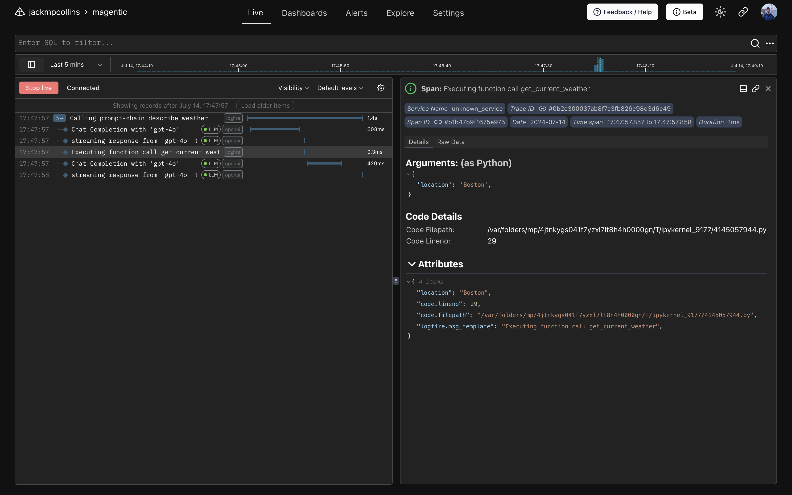
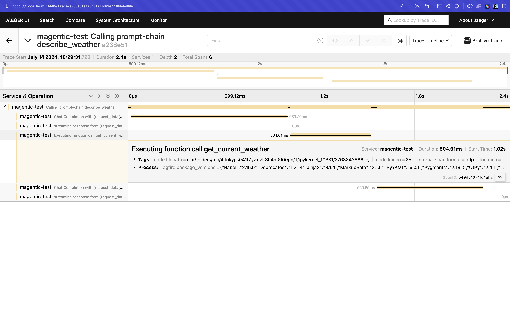

# Logging and Tracing

magentic is instrumented for logging and tracing using [Pydantic Logfire](https://pydantic.dev/logfire). This also makes it compatible with OpenTelemetry.

## Logging to stdout

To print magentic spans and logs to stdout, first install the `logfire` Python package.

```sh
pip install logfire
```

Then configure this as needed. See the [Pydantic Logfire Integrations docs](https://docs.pydantic.dev/logfire/integrations/) for the full list of integrations and how to configure these.

```python
import logfire

logfire.configure(send_to_logfire=False)
logfire.instrument_openai()  # optional, to trace OpenAI API calls
# logfire.instrument_anthropic()  # optional, to trace Anthropic API calls
```

Now when running magentic code, all spans and logs will be printed.

```
23:02:34.197 Calling prompt-chain describe_weather
23:02:34.221   Chat Completion with 'gpt-4o' [LLM]
23:02:35.364   streaming response from 'gpt-4o' took 0.05s [LLM]
23:02:35.365   Executing function call get_current_weather
23:02:35.399   Chat Completion with 'gpt-4o' [LLM]
23:02:35.992   streaming response from 'gpt-4o' took 0.12s [LLM]
```

## Using Pydantic Logfire

Create a Pydantic Logfire account following their [First Steps Guide](https://docs.pydantic.dev/logfire/guides/first_steps/).

After authenticating locally and creating a project, configure logfire

```python
import logfire

logfire.configure()  # note: `send_to_logfire` removed. This defaults to True
logfire.instrument_openai()  # optional, to trace OpenAI API calls
# logfire.instrument_anthropic()  # optional, to trace Anthropic API calls
```

Now calls to magentic prompt-functions, prompt-chains etc. will become visible in the Logfire UI.



## Configuring OpenTelemetry

To enable instrumentation for use with OpenTelemetry, use the following logfire configuration

```python
import logfire

logfire.configure(
    send_to_logfire=False,
    service_name="magentic-test",  # optional, can be set using OTEL_SERVICE_NAME env var
)
logfire.instrument_openai()  # optional, to trace OpenAI API calls
# logfire.instrument_anthropic()  # optional, to trace Anthropic API calls
```

Now logs and traces for magentic (and OpenAI, Anthropic, ...) will be available to any OTEL tracers.

### Viewing Traces Locally

To view traces locally you can use [Jaeger](https://www.jaegertracing.io/).

First start the Jaeger all-in-one docker container

```sh
docker run --rm --name jaeger \
  -p 16686:16686 \
  -p 4317:4317 \
  -p 4318:4318 \
  jaegertracing/all-in-one:1.58
```

Then navigate to [http://localhost:16686](http://localhost:16686) to access the Jaeger UI. See the [Jaeger Getting Started Guide](https://www.jaegertracing.io/docs/latest/getting-started/) for up-to-date instructions.

Next, install the required OpenTelemetry exporter and configure OpenTelemetry to use this to send traces to Jaeger.

```sh
pip install opentelemetry-exporter-otlp
```

```python
from opentelemetry import trace
from opentelemetry.sdk.trace.export import BatchSpanProcessor
from opentelemetry.exporter.otlp.proto.http.trace_exporter import OTLPSpanExporter

trace.get_tracer_provider().add_span_processor(BatchSpanProcessor(OTLPSpanExporter()))
```

Now, traces for magentic code run locally will be visible in the Jaeger UI.



## Enabling Debug Logging

The neatest way to view the raw requests sent to LLM provider APIs is to use Logfire as described above. Another method is to enable debug logs for the LLM provider's Python package. The `openai` and `anthropic` packages use the standard library logger and expose an environment variable to set the log level. See the [Logging section of the openai README](https://github.com/openai/openai-python/tree/65e29a2efa455a06deb59e243f27796c4ca2254c?tab=readme-ov-file#logging) or [Logging section of the anthropic README](https://github.com/anthropics/anthropic-sdk-python#logging) for more information.

Here's an example of what the debug log contains for a simple magentic prompt-function (formatted to improve readability).

```python
import logging

from magentic import prompt

logging.basicConfig(level=logging.DEBUG)


def plus(a: int, b: int) -> int:
    return a + b


@prompt(
    "Say hello {n} times",
    functions=[plus],
)
def say_hello(n: int) -> str: ...


say_hello(2)
# ...
# > DEBUG:openai._base_client:Request options: {
#     "method": "post",
#     "url": "/chat/completions",
#     "files": None,
#     "json_data": {
#         "messages": [{"role": "user", "content": "Say hello 2 times"}],
#         "model": "gpt-3.5-turbo",
#         "functions": [
#             {
#                 "name": "plus",
#                 "parameters": {
#                     "properties": {
#                         "a": {"title": "A", "type": "integer"},
#                         "b": {"title": "B", "type": "integer"},
#                     },
#                     "required": ["a", "b"],
#                     "type": "object",
#                 },
#             }
#         ],
#         "max_tokens": None,
#         "stream": True,
#         "temperature": None,
#     },
# }
# ...
```
